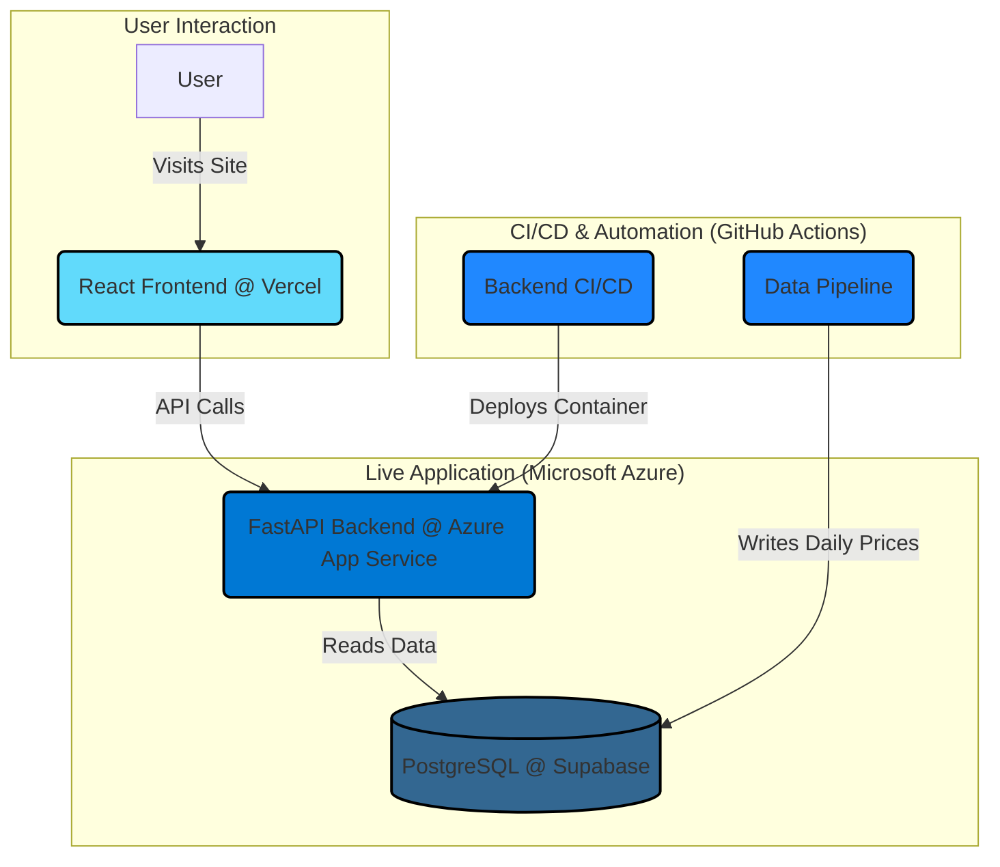

# 🚀 AlphaPredict: Full-Stack Stock Prediction Platform

AlphaPredict is an advanced, full-stack stock analysis platform featuring a decoupled, cloud-native architecture. It leverages a high-performance **LightGBM** model for predictions, served via a **FastAPI** backend that is automatically built, containerized, and deployed to **Microsoft Azure** using a complete CI/CD pipeline.


## ✨ Core Features

- **Azure-Native Backend**: The containerized FastAPI backend is deployed to **Azure App Service**, demonstrating enterprise-grade cloud skills.
- **Automated CI/CD Pipeline**: On every push to `main`, a **GitHub Actions** workflow automatically builds a Docker image, pushes it to **Azure Container Registry**, and deploys the new version to production.
- **Advanced ML Model**: Utilizes a **LightGBM Gradient Boosting** model for superior prediction accuracy.
- **Decoupled Data Pipeline**: A separate, scheduled GitHub Action handles all data ingestion, ensuring the live API is never impacted by heavy data-fetching tasks.
- **Interactive UI**: A sleek, modern dashboard built with **React** and **TailwindCSS**, hosted on Vercel's global edge network.

## 🏛️ System Architecture

The application is composed of distinct services that work in concert. This decoupled design is a key feature, enhancing scalability, resilience, and performance.



##  DevOps & CI/CD Highlights

This project demonstrates several core DevOps principles:

- **CI/CD for Applications**: The [`.github/workflows/deploy-to-azure.yml`](.github/workflows/deploy-to-azure.yml) workflow automates the build, test, and deployment of the containerized backend to Azure on every push to `main`.
- **CI/CD for Data**: The [`.github/workflows/daily_data_fetch.yml`](.github/workflows/daily_data_fetch.yml) pipeline manages the automated, scheduled ingestion of data, treating data operations as a first-class citizen.
- **Infrastructure as Code (IaC)**: The database schema is version-controlled ([`data_pipeline/db_setup.sql`](data_pipeline/db_setup.sql)), and the entire cloud deployment is defined as code within GitHub Actions workflows.
- **Containerization**: The backend is fully containerized with Docker, ensuring consistency from local development to production on Azure.
- **Configuration Management**: All secrets are managed securely using GitHub Secrets and Azure App Service configuration, following 12-Factor App principles.

## 🛠️ Tech Stack

| Category | Technology |
|---|---|
| **Frontend** | React 19, Vite, TailwindCSS, Recharts |
| **Backend** | FastAPI, Python 3.11, Docker |
| **Database** | PostgreSQL (hosted on Supabase) |
| **ML Model** | LightGBM, Scikit-learn, Pandas |
| **CI/CD** | **GitHub Actions** |
| **Deployment**| Vercel (Frontend), **Azure App Service** (Backend), **Azure Container Registry** |

## 🌐 Deployment

This project is deployed as a set of independent, communicating services.

### 1. Backend (Azure App Service via CI/CD)
The backend is deployed automatically by the [`.github/workflows/deploy-to-azure.yml`](.github/workflows/deploy-to-azure.yml) workflow.

**Setup required:**
1.  **Create Azure Resources**:
    *   An **Azure Container Registry (ACR)** to store the Docker images.
    *   An **Azure App Service** configured to run Docker containers.
2.  **Create Azure Credentials**: Generate a Service Principal for GitHub Actions to use.
    ```bash
    # Install Azure CLI, then run:
    az login
    az ad sp create-for-rbac --name "GitHubActions-StockPredictor" --role contributor --scopes /subscriptions/{your-subscription-id} --sdk-auth
    ```
3.  **Configure GitHub Secrets**:
    *   In your GitHub repo, go to **Settings > Secrets and variables > Actions**.
    *   Create `AZURE_CREDENTIALS` and paste the JSON output from the previous step.
    *   Create `DATABASE_URL`, `SECRET_KEY`, etc., which will be used by the data pipeline.
4.  **Configure App Service**: In the Azure Portal, add your `DATABASE_URL`, `SECRET_KEY`, etc., to the App Service's configuration.

### 2. Frontend (Vercel)
1.  Import your repository on Vercel.
2.  Configure:
    *   **Framework Preset**: Vite
    *   **Root Directory**: `frontend`
3.  Add environment variables:
    *   `VITE_API_BASE`: Your backend URL from Azure App Service.
    *   `VITE_GOOGLE_CLIENT_ID`: Your Google Client ID.
4.  Deploy.

## ⚙️ Local Development

(Instructions for local setup remain the same, allowing developers to work on any component without needing a full cloud environment.)

### Prerequisites
- Python 3.11+
- Node.js 18+
- A PostgreSQL database instance

### Setup
1.  **Clone & Navigate**: `git clone https://github.com/dhruvmohan867/stock-predictor.git && cd stock-predi`
2.  **Activate Python Env**: `python -m venv venv && source venv/bin/activate` (or `.\venv\Scripts\activate` on Windows)
3.  **Install Dependencies**: `pip install -r backend/requirements.txt -r data_pipeline/requirements.txt`
4.  **Setup Database**: Run the script from `data_pipeline/db_setup.sql` on your database.
5.  **Run Data Pipeline**: `python data_pipeline/fetch_data.py`
6.  **Train Model**: `python ml_model/train.py`
7.  **Run Backend**: `uvicorn backend.main:app --reload`
8.  **Run Frontend**: `cd frontend && npm install && npm run dev`

## 📝 License

This project is licensed under the MIT License. See the [LICENSE](LICENSE) file for details.